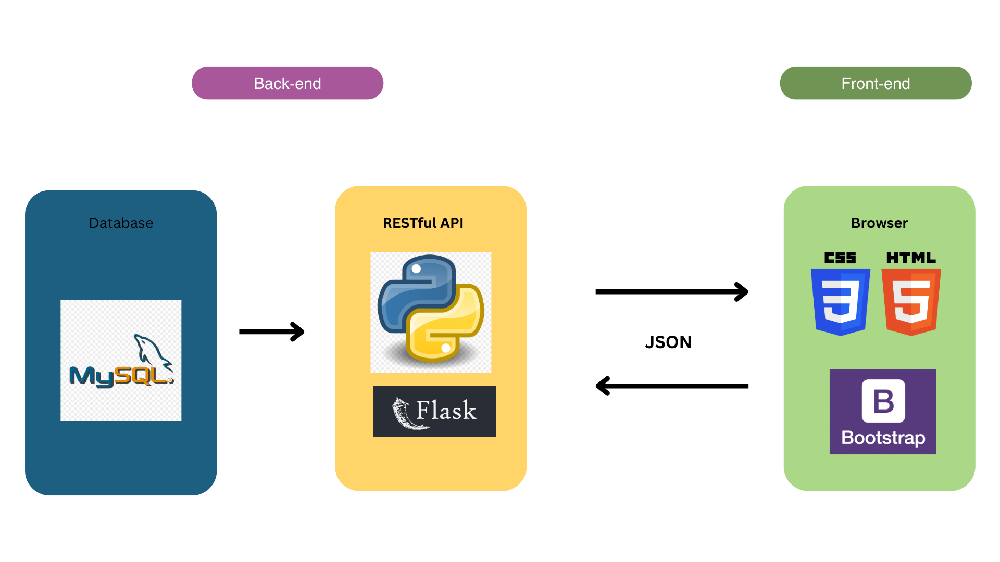

# PostIt

PostIt is a web application designed for conception, deliberation and implementation of ideas. PostIt is designed for creative thinkers, writers and experts to expose their ideas to the world. A platform where readers and writers collaborate on important ideas leading to discovery and growth.

*“We write to taste life twice, in the moment and in retrospect.”*
― **Anais Nin**

## Architecure

### Backend

PostIt's backend is written primarily in Python. Python was used because as the backend language because it has a wide variety of web application frameworks such as Flask. Flask was used as the web framework to build a RESTful API because it is light, flexible and was covered in previous projects so this was a chance to show what I learnt.

For the database I used a MySQL server because the relational database is most suited for structured data in this application. This was also another opportunity to implement knowledge gained from previous tasks.

### Frontend

For the front-end, I used HTML and CSS for the earlier parts of the project, however, as more features kept coming up I decided to use Bootstrap. Native implementations of features such as navigation bars were sourced from Bootstrap. Some creative freedom was lost in the process but this was what worked best in the project timeline.

Here we have a diagram that shows the tech stack that make up PostIt:

## User Experience

Below is a simple flow for the user experience on PostIt:

## Getting Started

1. Clone this repository
2. Activate the virtual environment by running `source [full path]/PostIt/env/bin/activate`
3. Run `flask run`. Once this is done you are ready to run **PostIt**. Navigation to your web browser and enter `localhost:5000`. Enjoy PostIt!

## Dependencies

The dependencies necessary for running PostIt are listed [here](requirements.txt)

## Author

**Salmon:** [Github](https://github.com/SalmonMbuchi) / [LinkedIn](https://www.linkedin.com/in/salmon-mbuchi/)
